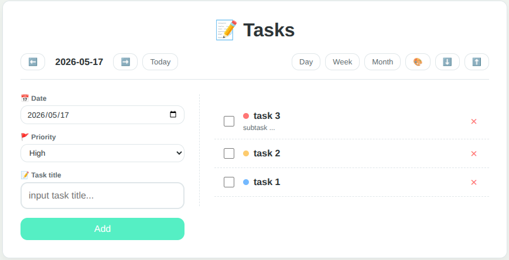

# 📝 Task Journal

A lightweight, beautiful task management tool that supports daily task logging, priority management, multi-view calendar, data import/export, and multiple theme switching.  
All data is stored locally in your browser — no backend required.



## ✨ Features

- **Day View**: Left-right split layout — add tasks on the left (date, priority, title), view task list on the right
- **Week/Month View**: Calendar grid showing task distribution; click any date to jump to day view
- **Task Management**:
  - Add tasks (title, priority, due date)
  - Mark tasks as complete (automatically records completion timestamp)
  - Delete tasks
  - Add detailed descriptions (click on a task to open modal)
- **Theme Switching**:
  - Default minimal forest
  - Cyber dark mode
  - Vintage parchment
- **Data Persistence**: Uses `localStorage` to store all task data
- **Import/Export**: JSON format backup and restore

## 🚀 Quick Start

### Online Demo
Visit your [GitHub Pages link] (if deployed)

### Run Locally
Download the TaskJournal.html app and run it on a web browser.

## 🛠️ Tech Stack

- Vanilla HTML5 + CSS3 (CSS variables for theming)
- Vanilla JavaScript (ES6)
- `localStorage` for data persistence
- Responsive layout (Flexbox + media queries)

## 📁 File Structure

```
task-journal/
├── TaskJournal.html   # Main application (single file)
└── README.md
```

## 📖 Usage Guide

### Add a Task
1. In day view, select **Date** and **Priority** from the left panel
2. Enter a task title
3. Click `Add` or press `Enter`

### View/Edit Details
- Click on the task title area to open the detail modal
- Add or modify the description, then click `Save`

### Switch Views
- Use the top buttons: `Day` / `Week` / `Month`

### Switch Theme
- Click the 🎨 button in the top bar to cycle through three themes

### Backup & Restore
- ⬇️ Export all tasks as a JSON file
- ⬆️ Import a previously backed up JSON file (will overwrite existing data)

## 🧩 Example Data Format

```json
[
  {
    "id": 1745362800000,
    "date": "2026-04-23",
    "title": "Complete project documentation",
    "description": "Write README and update API docs",
    "completed": false,
    "created_at": "2026-04-23T10:00:00.000Z",
    "finished_at": null,
    "priority": "high"
  }
]
```

## 🌐 Browser Compatibility

Works in all modern browsers (Chrome, Firefox, Edge, Safari). Requires JavaScript and `localStorage` enabled.


**Enjoy your task journal!** ✅
